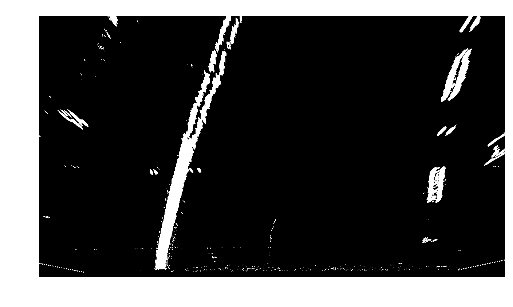
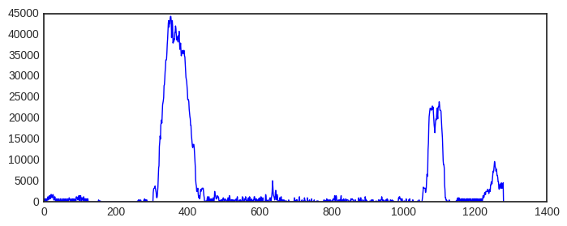

# Self-Driving Car Engineer Nanodegree
## Computer Vision: Advanced Lane Finding

### Overview

The objective of this project is to identify lane lines using traditional computer vision techniques. In order to achieve this, we have designed a computer vision pipeline as depicted below.

<p align="center">
 
</p>

The input of our pipeline would be images or video clips. Input images or videos will go through various pipeline stages (will be discussed in the latter part of this document) and produce annotated video and images as given below.

Image | Video
------------|---------------
 | 

Next, we are going to describe our pipeline stages starting from the Camera Calibrator. The sample input and output of the Camera Calibrator pipeline stage is given below.

### Camera Calibrator

Camera calibration logic is encapsulated in **`CameraCalibrator`** class in the **`advanced_lane_finding.py`** module. This class's constructor takes following arguments.

1. A list of camera images which we are going to use for camera calibration. (Usually, we use chessboard images)
2. Number of corners in X direction
3. Number of corners in Y direction
4. A boolean flag, if it is True, we do camera calibration and store those calibration data. 

The public method of this **`CameraCalibrator`** class is **`undistort`** and it takes a distorted image as the input and produces an undistorted image.

<p align="center">
 
</p>

### Warp Transformer

The second step of the lane line finding pipeline is "perspective transformation" step. In computer vision,  an image perspective is a phenomenon where objects appear smaller the further away they are from a viewpoint.   

A perspective transform maps the points in a given image to different, desired, image points with a new perspective. In the project we are going to use bird’s-eye view transform that allows us to view a lane from above; this will be useful for calculating the lane curvature in step 4.

Warped operation is encapsulated in **`PerspectiveTransformer`** class of the **`advanced_lane_finding.py`** package located in **`$PROJECT_HOME/src`** folder. In order to create an instance of **`PerspectiveTransformer`**  class, we need to provide four source and destination points. In order to clearly visible lane lines, we have selected following source and destination points. 

|Source Points | Destination Points|
|--------------|-------------------|
|(253, 697)    |   (303, 697)      |
|(585, 456)    |   (303, 0)        |
|(700, 456)    |   (1011, 0)       |
|(1061, 690)   |   (1011, 690)     |


I verified the performance of my perspective transformation by transforming an image (**`../output_images/undistorted_test_images/straight_lines2.jpg`**) using above source and destination points as given below.

<p align="center">
 
</p>

### Binarizer

Correctly identifying lane line pixels is one of the main tasks of this project. In order to identify lane line, we have used three main techniques namely:

1. Sobel operation in X direction
2. Color thresholding in S component of the HLS color space.
3. Color thresholding in L component of the HLS color space.

These three operations are encapsulated in the method called **`binarize`** in **`advanced_lane_finding.py`** module located in **`$PROJECT_HOME/src`** folder.

Also, below shows the `binarize` operation applied to a sample image.

<p align="center">
 
</p>

### Lane Line Extractor

Now we have extracted lane line pixels. So next step would be calculating the road curvature and other necessary quantities (such as how much the vehicle off from the center of the lane)

In order to calculate road curvature, we have used two methods as given below.
1. **`naive_lane_extractor(self, binary_warped)`** (inside the **Line** class in advanced_line_finding module)
2. **`smart_lane_extractor(self, binary_warped)`** (inside the **Line** class in advanced_line_finding module

Both methods take a binary warped image (similar to one shown above) and produce X coordinates of both left and right lane lines. `naive_lane_extractor(self, binary_warped)` method uses **sliding window** to identify lane lines from the binary warped image and then uses a second order polynomial estimation technique to calculate road curvature. 

In this section, we explain the algorithm we used in the **`naive_lane_extractor(self, binary_warped)`** method.

* **`naive_lane_extractor(self, binary_warped)`** algorithm expects a binary warped image such as one shown below.

<p align="center">
 
</p>

* Next, we calculate a histogram of pixel intencities using the first half (starting from the bottom of the image) the image as shown below.

<p align="center">
 
</p>

```python
for window in range(nwindows):
    win_y_low = warped_image.shape[0] - (window + 1) * window_height
    win_y_high = warped_image.shape[0] - window * window_height

    win_xleft_low = leftx_current - margin
    win_xleft_high = leftx_current + margin
    win_xright_low = rightx_current - margin
    win_xright_high = rightx_current + margin

    good_left_inds = ((nonzeroy >= win_y_low) & (nonzeroy < win_y_high) & 
                      (nonzerox >= win_xleft_low) & (nonzerox < win_xleft_high)).nonzero()[0]
    good_right_inds = ((nonzeroy >= win_y_low) & (nonzeroy < win_y_high) & 
                       (nonzerox >= win_xright_low) & (nonzerox < win_xright_high)).nonzero()[0]

    # Append these indices to the lists
    left_lane_inds.append(good_left_inds)
    right_lane_inds.append(good_right_inds)

    if len(good_left_inds) > min_num_pixels:
        leftx_current = np.int(np.mean(nonzerox[good_left_inds]))
    if len(good_right_inds) > min_num_pixels:
        rightx_current = np.int(np.mean(nonzerox[good_right_inds]))

# Concatenate the ndarrays of indices
left_lane_array = np.concatenate(left_lane_inds)
right_lane_array = np.concatenate(right_lane_inds)

# Extract left and right line pixel positions
leftx = nonzerox[left_lane_array]
lefty = nonzeroy[left_lane_array]
rightx = nonzerox[right_lane_array]
righty = nonzeroy[right_lane_array]

# Fit a second order polynomial to each
left_fit = np.polyfit(lefty, leftx, 2)
right_fit = np.polyfit(righty, rightx, 2)

fity = np.linspace(0, warped_image.shape[0] - 1, warped_image.shape[0])
fit_leftx = left_fit[0] * fity ** 2 + left_fit[1] * fity + left_fit[2]
fit_rightx = right_fit[0] * fity ** 2 + right_fit[1] * fity + right_fit[2]

self.detected = True
return fit_leftx, fit_rightx
```


### Lane Line Curvature Calculator

### Highlighted Lane Line and Lane Line Information

-----------------------------------------------------------------------------
## Advanced Lane Finding
[](http://www.udacity.com/drive)


In this project, your goal is to write a software pipeline to identify the lane boundaries in a video, but the main output or product we want you to create is a detailed writeup of the project.  Check out the [writeup template](https://github.com/udacity/CarND-Advanced-Lane-Lines/blob/master/writeup_template.md) for this project and use it as a starting point for creating your own writeup.  

Creating a great writeup:
---
A great writeup should include the rubric points as well as your description of how you addressed each point.  You should include a detailed description of the code used in each step (with line-number references and code snippets where necessary), and links to other supporting documents or external references.  You should include images in your writeup to demonstrate how your code works with examples.  

All that said, please be concise!  We're not looking for you to write a book here, just a brief description of how you passed each rubric point, and references to the relevant code :). 

You're not required to use markdown for your writeup.  If you use another method please just submit a pdf of your writeup.

The Project
---

The goals / steps of this project are the following:

* Compute the camera calibration matrix and distortion coefficients given a set of chessboard images.
* Apply a distortion correction to raw images.
* Use color transforms, gradients, etc., to create a thresholded binary image.
* Apply a perspective transform to rectify binary image ("birds-eye view").
* Detect lane pixels and fit to find the lane boundary.
* Determine the curvature of the lane and vehicle position with respect to center.
* Warp the detected lane boundaries back onto the original image.
* Output visual display of the lane boundaries and numerical estimation of lane curvature and vehicle position.

The images for camera calibration are stored in the folder called `camera_cal`.  The images in `test_images` are for testing your pipeline on single frames.  To help the reviewer examine your work, please save examples of the output from each stage of your pipeline in the folder called `ouput_images`, and include a description in your writeup for the project of what each image shows.    The video called `project_video.mp4` is the video your pipeline should work well on.  

The `challenge_video.mp4` video is an extra (and optional) challenge for you if you want to test your pipeline under somewhat trickier conditions.  The `harder_challenge.mp4` video is another optional challenge and is brutal!

If you're feeling ambitious (again, totally optional though), don't stop there!  We encourage you to go out and take video of your own, calibrate your camera and show us how you would implement this project from scratch!
